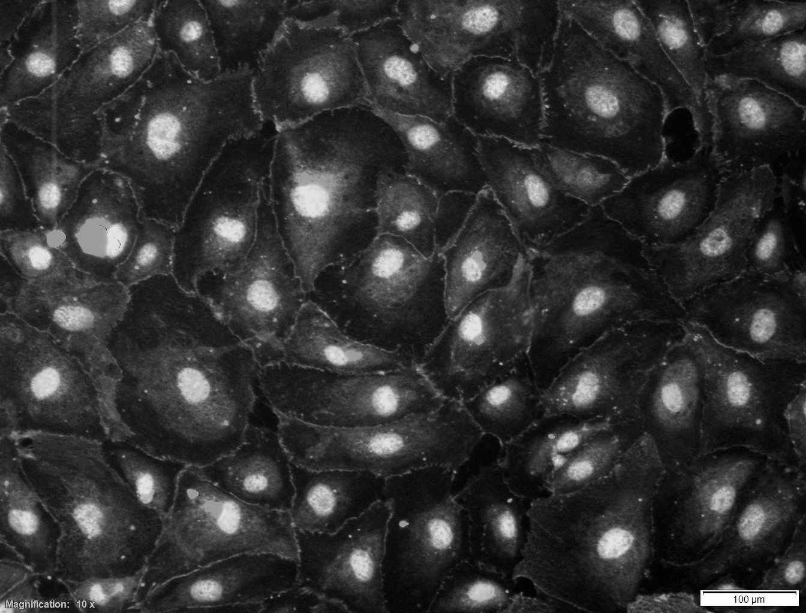
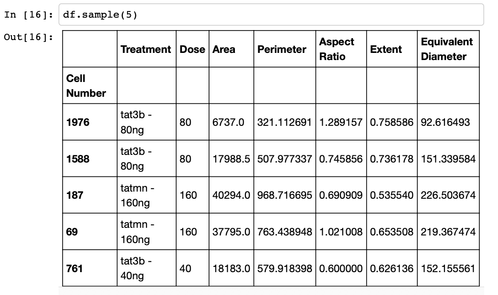

# Unet: Deep Learning Model for Cell Segmentation
 
---
 
## Introduction

I have included here a machine learning model and framework, guiding the user from raw microscopy images to a structured data frame encapsulating quantifiable cell attributes, such as area and perimeter.

This computational AI model arises from the necessity to accurately quantify large amounts of cell metrics, specifically focusing on Blood-Brain Barrier (BBB) cells. This endeavor seeks to quantitatively demonstrate the consequences of HIV drug treatment on brain cells. Traditional methods such as manual segmentation are markedly inefficient, posing considerable time constraints on researchers. For example, a proficiently trained U-Net deep learning model can segment thousands of cells within seconds, in comparison to the manual process which averages 15 minutes per image.

## Data
 
The raw input data consist of microscopy images of BBB cells like the following:
 

 
 
The folder data/membrane contains a selection of microscopy images along with their corresponding masks to train the AI model.

The code in this repository turns the raw data above into a quantitative data frame that can be analyzed statistically. Here is an example:
 

 
 
 
### Model
 

 
Credit: O. Ronneberger and P. Fischer and T. Brox. [U-Net: Convolutional Networks for Biomedical Image Segmentation](http://lmb.informatik.uni-freiburg.de/people/ronneber/u-net/).
Medical Image Computing and Computer-Assisted Intervention (MICCAI), Springer, LNCS, Vol.9351 (2015): pp. 234-241.
 
 
 
### Results
 
The  trained model boasts an impressive accuracy rate of 98%. Below is a visualization exemplifying the successful application of U-Net on BBB microscopy images (press the play button to see visualization):
 

 
 
The left visual stream delineates U-Net's progressive enhancement through epochs. The right delineates manually segmented test set masks.

Credit: Will Dampier, Drexel University, 2019. 
 
 
 
### Post-processing
 
Following deep learning-based segmentation, the anticipated masks require further refinement to transition them into analytically viable quantitative data. The file "JSON mask parser.ipynb" includes custom code responsible for parsing cellular coordinates from the AI-generated masks and subsequently extracting pertinent features such as the area and perimeter of each cell into a CSV data frame. The "Descriptives and visualizations.ipynb" file provides a simple overview of preliminary data explorations using Pandas and Seaborn. Lastly, the "autoencoder" file integrates an autoencoder machine learning model to perform anomaly detection on the final data. The autoencoder documentation presents a visualization contrasting regular (black) and anomalous (blue) cellular shapes, providing a new quantitative methodology for analyzing rates of infection in cell data.
