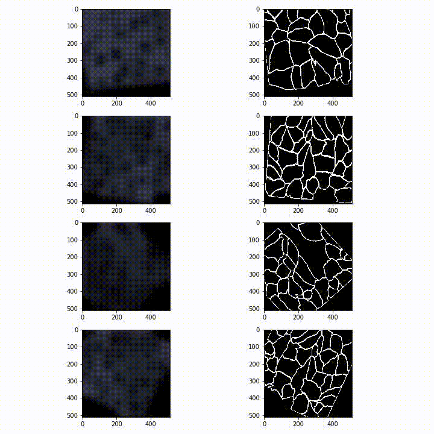

# Unet: Deep Learning Model for Cell Segmentation

# This repository includes code for the Unet based deep learning model for cell segmentation

Credit: O. Ronneberger and P. Fischer and T. Brox. [U-Net: Convolutional Networks for Biomedical Image Segmentation](http://lmb.informatik.uni-freiburg.de/people/ronneber/u-net/). 
Medical Image Computing and Computer-Assisted Intervention (MICCAI), Springer, LNCS, Vol.9351 (2015): pp. 234-241.

---

## Overview

The motivation behind pursuing this tool stems from the need to quantify a large number of cell data, in this case Blood-Brain Barrier cell data, 
for the purpose of analyzing the impacts of HIV-1 Tat Proteins on the Blood-Brain Barrier (BBB hereafter). While manual segmentation by hand is an option, 
it is very slow and time-consuming. Researchers face a high opportunity cost on time when engaging in this process of manual segmentation. A trained Unet deep 
learning model can segment thousands of cells in a matter of seconds versus manual segmentation by hand which takes, on average, 15 minutes 
per image to complete.

This repository contains necessary code to start from raw microscopy images all the way to producing a data frame that contains a multitude of quantitative
features like area and perimeter belonging to each cell. 

Here is an example of what this data frame looks like:

## Data

The data consists of microscopy images of BBB cells like the following:

data/membrane contains sample microscopy images and corresponding masks used for training Unet.

### Model

Credit: O. Ronneberger and P. Fischer and T. Brox. [U-Net: Convolutional Networks for Biomedical Image Segmentation](http://lmb.informatik.uni-freiburg.de/people/ronneber/u-net/). 
Medical Image Computing and Computer-Assisted Intervention (MICCAI), Springer, LNCS, Vol.9351 (2015): pp. 234-241.

### Results

The trained model achieves good results with 97% accuracy. Here is a sample result following the successful implementation of Unet on BBB microscopy images:

Credit: Professor Will Dampier, Drexel Univerty College of Medicine. 

### Post-processing

The deep learning implementation produces predicted masks for each microscopy image. Predicted masks require post-processing to turn them into 
quantitative data that are suitable for statistical analysis. The file named "Json mask parser.ipynb" contains code that parses cell coordinates from predicted masks 
generated by Unet, extracts features like area, aspect ratio and perimeter, and produces an organized data frame in CSV format.
For some exploration of a sample data frame using Pandas and Seaborn, please see the file titled "Descriptives and Visualization.ipynb".

